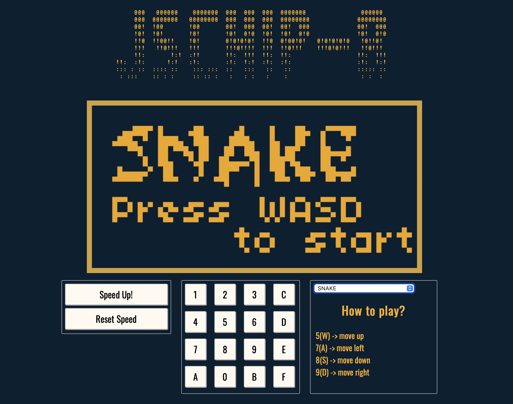

<!-- ABOUT THE PROJECT -->
## About The Project

An emulator is a program that allows a computer to mimic another device, such as a gaming console or old computer. Creating an emulator is an engaging project that involves understanding how different systems work and figuring out how to run them on a different device. The goal is to learn about simple computers and make the emulator function like the real device in order to play retro games. It is a good way to learn more about the systems of interest and understand their function.